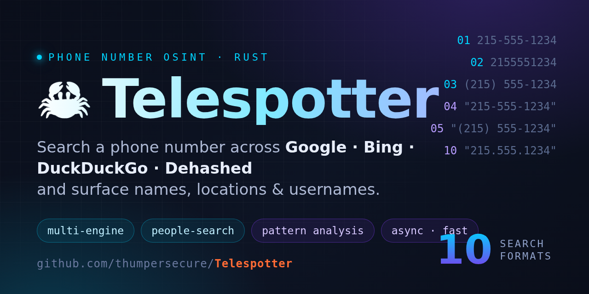

<div align="center">

<!-- Social preview -->


<!-- Animated Typing Header -->
<a href="https://github.com/thumpersecure/telespotter">
  
</a>

<!-- Compact ASCII Logo -->
```
  ______     __     ____                  __  __
 /_  __/__  / /__  / __/__  ___  ______  / /_/ /____  _____
  / / / _ \/ / _ \_\ \/ _ \/ _ \/ __/ / / __/ __/ _ \/ ___/
 / / /  __/ /  __/___/ .__/\___/\__/\__/\__/\__/\___/_/
/_/  \___/_/\___/   /_/                           v2.1.0
```

<!-- Blue Gradient Line -->


<!-- Badges -->
[](LICENSE)
[](https://www.rust-lang.org/)
[](https://github.com/thumpersecure/telespotter)
[](https://github.com/thumpersecure/telespotter)

**A blazingly fast phone number OSINT tool** — Search across multiple engines and people lookup sites to gather intelligence on any US phone number. Every number is searched in **10 format variations** (dashed, parenthesized, quoted exact-match, and international) to maximize hits.


</div>

## ⚡ Quick Start

```bash
git clone https://github.com/thumpersecure/telespotter.git && cd telespotter
cargo build --release
./target/release/telespotter 5551234567 -p --random-ua -c -s
```


## 🌟 Features Overview

### 🔍 Smart Search Technology
- **Quoted exact-match searches** — All queries use `"xxx-xxx-xxxx"` format for precise results
- **4 phone format variations** — Searches multiple formats simultaneously:
  - `555-123-4567` (dashed)
  - `(555) 123-4567` (parenthesized)
  - `5551234567` (continuous)
  - `1 555-123-4567` (with country code)
- **Google API support** — Uses official API when `GOOGLE_API_KEY` and `GOOGLE_SEARCH_ENGINE_ID` env vars are set
- **Fallback web scraping** — Automatically scrapes when API unavailable

### 🎭 Anti-Detection
- **15 rotating user agents** — Chrome, Firefox, Safari, Edge on Windows/macOS/Linux
- **Configurable rate limiting** — Adjustable delays between requests
- **Exponential backoff retries** — Automatic retry with increasing delays

### 📊 Pattern Analysis Engine
| Data Type | Extraction Details |
|-----------|-------------------|
| 📛 **Names** | 2-3 word capitalized names with smart filtering |
| 📍 **Locations** | All 50 US states + DC, city-state combos, ZIP codes |
| 📧 **Emails** | Filtered for false positives (excludes example.com, noreply@, etc.) |
| 👤 **Usernames** | @mentions and social profile URLs |
| 🔗 **Social URLs** | Facebook, Twitter/X, Instagram, LinkedIn, TikTok, Snapchat, YouTube, Pinterest |

### 🔧 OSINT Tool Integration
| Tool | Purpose | Command |
|------|---------|---------|
| 🔎 **Sherlock** | Username search across 400+ sites | `--sherlock` |
| 🐦 **Blackbird** | Email account discovery | `--blackbird` |
| 📱 **email2phonenumber** | Reverse email-to-phone lookup | `--email2phone` |


## 🔍 Search Sources

<table>
<tr>
<td width="50%">

### 🌐 Search Engines
| Engine | Method |
|--------|--------|
| Google | API or Scraping |
| Bing | Web Scraping |
| DuckDuckGo | Web Scraping |

</td>
<td width="50%">

### 🏠 People Search Sites
| Site | Data |
|------|------|
| Whitepages | Names, addresses |
| TruePeopleSearch | Owner, relatives |
| FastPeopleSearch | Quick lookups |
| ThatsThem | Comprehensive |
| USPhoneBook | Carrier info |

</td>
</tr>
</table>


## 🏠 People Search Sites

Search directly from 5 major people lookup databases with `-p`:

| Site | What It Finds | Flag |
|------|---------------|------|
| 📖 **Whitepages** | Full names, current/past addresses, phone records, age | `--whitepages` |
| 👥 **TruePeopleSearch** | Owner info, relatives, associates, neighbors | `--truepeoplesearch` |
| ⚡ **FastPeopleSearch** | Quick lookups with age, location, possible relatives | `--fastpeoplesearch` |
| 🎯 **ThatsThem** | Comprehensive profile: email, address, social profiles | `--thatsthem` |
| 📱 **USPhoneBook** | Phone carrier, line type, owner details | `--usphonebook` |

```bash
# Search ALL people sites
telespotter 5551234567 -p

# Search specific sites only
telespotter 5551234567 -p --whitepages --truepeoplesearch

# Combine with search engines
telespotter 5551234567 -p -e google --random-ua
```


## 🔎 OSINT Tool Integration

TeleSpotter automatically detects found usernames and emails, then offers to run external OSINT tools:

### Sherlock — Username Search
Searches 400+ social networks for matching usernames.
```bash
# Auto-run on found usernames
telespotter 5551234567 --sherlock

# Or get prompted after scan finds usernames
telespotter 5551234567 -p
# Output: "Found 3 username(s). Run Sherlock to find social media profiles? (y/n)"
```
**Install:** `pip install sherlock-project`

### Blackbird — Email Search
Searches for accounts associated with found email addresses.
```bash
# Auto-run on found emails
telespotter 5551234567 --blackbird

# Or get prompted after scan finds emails
telespotter 5551234567 -p
# Output: "Found 2 email(s). Run Blackbird to search for accounts? (y/n)"
```
**Install:** `pip install blackbird`

### email2phonenumber — Reverse Lookup
Attempts to find phone numbers associated with email addresses.
```bash
# Auto-run reverse lookup
telespotter 5551234567 --email2phone
```
**Install:** `pip install email2phonenumber`

### Skip All Prompts
```bash
# For scripting - no interactive prompts
telespotter 5551234567 -p --no-osint-prompts -s

# Auto-run all tools without prompts
telespotter 5551234567 -p --sherlock --blackbird --email2phone
```


## 🚀 Usage

### Interactive Mode
```bash
# Prompts for phone number, save options, and OSINT tools
telespotter
```

### Direct Input
```bash
# Accepts multiple input formats
telespotter 5551234567
telespotter "(555) 123-4567"
telespotter 1-555-123-4567
telespotter 15551234567
```

### Common Workflows

```bash
# Full OSINT scan with all features
telespotter 5551234567 -p --random-ua -c -s --sherlock --blackbird

# Quick people search only
telespotter 5551234567 -p

# Automated scripting (no prompts)
telespotter 5551234567 -q --no-osint-prompts -s -f json

# Specific search engines only
telespotter 5551234567 -e google -e bing

# Specific people sites only
telespotter 5551234567 -p --whitepages --thatsthem

# High-volume with rate limiting
telespotter 5551234567 --delay 3 --random-ua --retries 3
```


## 📋 Complete CLI Reference

```
USAGE: telespotter [OPTIONS] [PHONE_NUMBER]

ARGUMENTS:
  [PHONE_NUMBER]              10 or 11 digit US phone number (any format)

CORE OPTIONS:
  -d, --debug                 Show errors and sample results
  -q, --quiet                 Minimal output (for scripting)
  -s, --save                  Auto-save results to file
  -c, --concurrent            Parallel engine searches (faster)
  -p, --people-search         Search people lookup sites

SEARCH CONFIGURATION:
  -n, --num-results <N>       Results per engine [default: 5]
  -e, --engines <ENGINE>      google, bing, duckduckgo, all [default: all]
  -t, --timeout <SECS>        HTTP request timeout [default: 10]
      --delay <SECS>          Delay between requests [default: 1]
      --retries <N>           Retry attempts on failure [default: 2]
      --random-ua             Rotate through 15 user agents

OUTPUT OPTIONS:
  -o, --output <FILE>         Custom output file path
  -f, --format <FMT>          json, csv, txt [default: json]
      --no-color              Disable colored terminal output
      --max-names <N>         Max names to show [default: 10]
      --max-locations <N>     Max locations to show [default: 10]
      --max-emails <N>        Max emails to show [default: 10]
      --max-usernames <N>     Max usernames to show [default: 10]

PEOPLE SEARCH SITES (use with -p):
      --whitepages            Whitepages only
      --truepeoplesearch      TruePeopleSearch only
      --fastpeoplesearch      FastPeopleSearch only
      --thatsthem             ThatsThem only
      --usphonebook           USPhoneBook only

OSINT TOOL INTEGRATION:
      --sherlock              Auto-run Sherlock on found usernames
      --blackbird             Auto-run Blackbird on found emails
      --email2phone           Auto-run email2phonenumber
      --no-osint-prompts      Skip all OSINT tool prompts

HELP:
  -h, --help                  Print help
  -V, --version               Print version
```


## 📁 Output Formats

### JSON (default)
Includes version, timestamp, all results, and pattern analysis:
```json
{
  "version": "2.1.0",
  "timestamp": "2024-01-15T10:30:00Z",
  "phone_number": "5551234567",
  "search_formats": ["555-123-4567", "(555) 123-4567", ...],
  "results": { ... },
  "pattern_analysis": { ... }
}
```

### CSV
Properly escaped with quote handling and newline sanitization:
```
Source,Title,Snippet
"Google","John Smith - Phone","Located in Philadelphia, PA..."
```

### TXT
Human-readable report with sections for names, locations, emails, usernames.


## ⚡ Performance

| Metric | Python | Rust | Improvement |
|--------|--------|------|-------------|
| Execution | 65s | 18s | **3.6x faster** |
| Memory | 48MB | 8MB | **6x less** |
| Startup | 800ms | 2ms | **400x faster** |
| Binary | Interpreter | 4.2MB | Single file |


## 🛠️ Installation

### From Source
```bash
# Prerequisites: Rust 1.70+
curl --proto '=https' --tlsv1.2 -sSf https://sh.rustup.rs | sh

# Build
git clone https://github.com/thumpersecure/telespotter.git
cd telespotter
cargo build --release

# Install system-wide (optional)
cargo install --path .
```

### Environment Variables (Optional)
```bash
# For Google Custom Search API (higher rate limits)
export GOOGLE_API_KEY="your-api-key"
export GOOGLE_SEARCH_ENGINE_ID="your-cx-id"
```

### Optional OSINT Tools
```bash
pip install sherlock-project    # Username search
pip install blackbird           # Email search
pip install email2phonenumber   # Reverse lookup
```


## 📁 Project Structure

```
telespotter/
├── main.rs              # CLI, orchestration, OSINT integration
├── phone.rs             # Phone number parsing & format generation
├── search.rs            # HTTP client, 15 user agents, SearchConfig
├── parser.rs            # Regex patterns for names, locations, emails, usernames
├── analysis.rs          # Pattern counting & result aggregation
├── google.rs            # Google API + scraping (quoted searches)
├── bing.rs              # Bing scraper
├── duckduckgo.rs        # DuckDuckGo scraper
├── whitepages.rs        # Whitepages scraper
├── truepeoplesearch.rs  # TruePeopleSearch scraper
├── fastpeoplesearch.rs  # FastPeopleSearch scraper
├── thatsthem.rs         # ThatsThem scraper
└── usphonebook.rs       # USPhoneBook scraper
```


## 🆘 Troubleshooting

| Issue | Solution |
|-------|----------|
| 0 results | Use `-d` to see errors; try `--random-ua`; wait 10-15 min if rate limited |
| Timeouts | Increase with `-t 30`; check firewall/proxy settings |
| Rate limited | Use `--delay 3 --random-ua`; set Google API keys for higher limits |
| Build errors | Run `rustup update && cargo clean && cargo build --release` |
| UTF-8 errors | Fixed in v2.1 - update to latest version |


## 🔒 Legal Notice

> **For legitimate investigative purposes only.**

- ✅ Uses publicly available search data
- ✅ Respects rate limits with configurable delays
- ❌ Do not use for harassment or stalking
- ❌ Do not violate terms of service
- ❌ Verify compliance with local laws


## 📦 Dependencies

| Crate | Purpose |
|-------|---------|
| `tokio` | Async runtime |
| `reqwest` | HTTP client |
| `scraper` | HTML parsing |
| `clap` | CLI argument parsing |
| `colored` | Terminal colors |
| `serde` / `serde_json` | JSON serialization |
| `regex` / `lazy_static` | Pattern matching |
| `rand` | User agent rotation |
| `chrono` | Timestamps |
| `anyhow` | Error handling |


<div align="center">

**Created by [Spin Apin](https://github.com/thumpersecure)**

[](https://github.com/thumpersecure)

<sub>Made with 🦀 Rust for OSINT professionals</sub>

**⚡ Fast • 🔒 Safe • 🎯 Effective**


</div>
